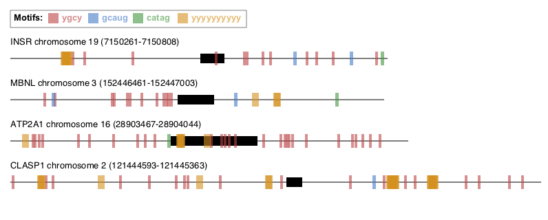

# Motif-Mark

Given a a list of gene sequences and motifs, this program will produce an image to visualize the locations of each motif across the gene sequences.

### Input
1. FASTA file with gene sequences 
    - Maximum of 10 sequences (≤1000 bases each)
    - Exons should be indicated by uppercase letters and introns by lowercase letters
2. Text file with a list of motifs to search 
    - One motif per line
    - Maximum of 5 motifs (≤10 bases each)

#### Argparse options:
    -f, --fasta: required arg, file path to FASTA file
    -m, --motifs: required arg, file path to motif text file

### Example Input Files:

FASTA:
>\>INSR chr19:7150261-7150808
>ctctgtcctcaaaggcgttggttttgtttccacagAAAAACCTCTTCAGGCACTGGTGCCGAGGACCCTAGgtatgactcacctgtgcgacccctgg\
>\>MBNL chr3:152446461-152447003
>atgttaatgcgcttgaaccccactggcccattgccatcatgtgctcgctgcctgctaattaagACTCAGTCGGCTGTCAAATCACTGAAGCGACCCCTCGAGGCAACCTTTGACCTGgtactatgacctttcaccttttagcttggcatgtagctttattgtagatacaagttttttttt

Motifs:
>ygcy\
>GCAUG\
>catag\
>YYYYYYYYYY

### Output
The program will output a single image (.png) per FASTA file containing each of the inputted sequences with labeled features (motifs, introns, exons) to scale as shown in the example figure below.

